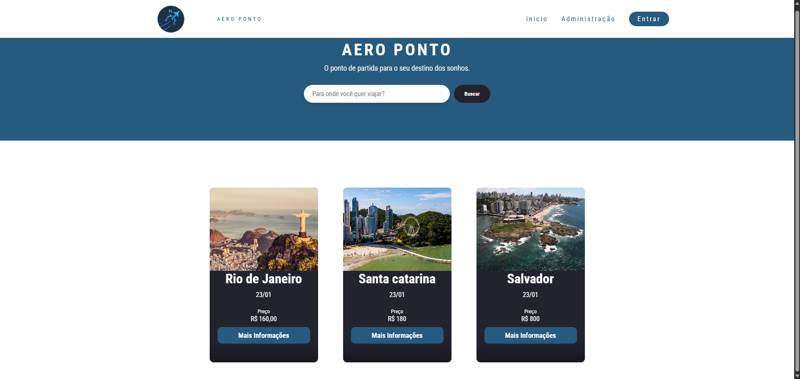
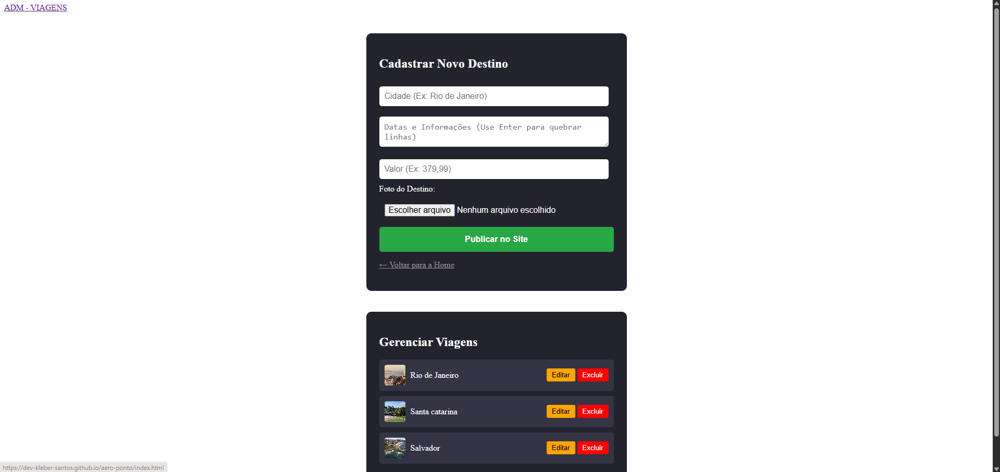

# ✈️ Aero Ponto - Gestão de Viagens (Em Desenvolvimento)

O **Aero Ponto** é uma plataforma para exploração e gerenciamento de destinos turísticos. O projeto está sendo construído com foco em design responsivo e manipulação dinâmica de dados.

🔗 **[Acesse o projeto online aqui](https://dev-kleber-santos.github.io/aero-ponto/)**

---

## 🛠️ Status do Projeto
🚀 Em desenvolvimento / Adicionando novas funcionalidades.

## 🚀 Funcionalidades Atuais
- **Vitrine Interativa:** Cards com efeito *Flip* para detalhes de viagens.
- **Menu Mobile:** Sistema de navegação lateral responsivo.
- **Filtro de Busca:** Pesquisa dinâmica por destinos via JavaScript.

## 📅 Próximas Implementações (To-Do)
- [ ] Validação de formulários de Login e Cadastro.
- [ ] Integração com LocalStorage para persistência de destinos cadastrados.
- [ ] Implementação de efeitos de Scroll Suave.
- [ ] Melhorias na acessibilidade (Tags ARIA).

## 🛠️ Tecnologias Utilizadas
- HTML5, CSS3 e JavaScript (ES6+).
## 📸 Demonstração do Projeto

### Home Page

### Painel Administrativo

### Login

---
Desenvolvido por [Kleber Mendonça] - 2026
